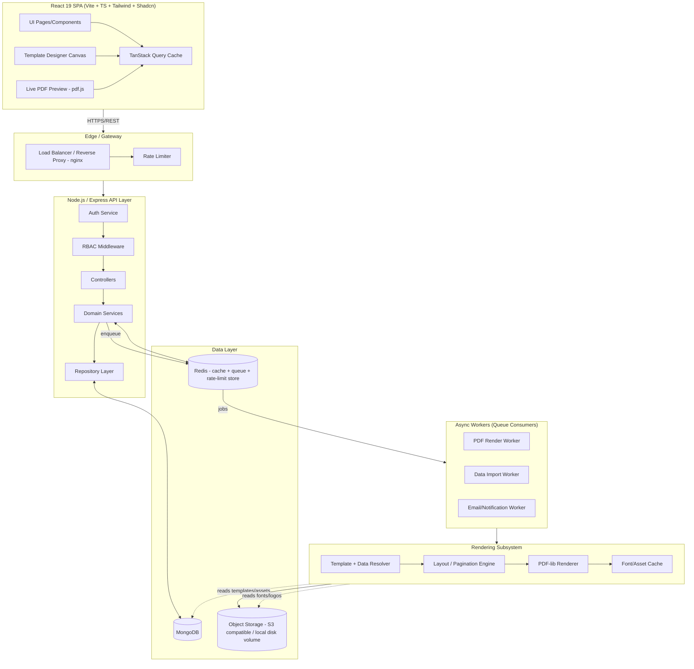
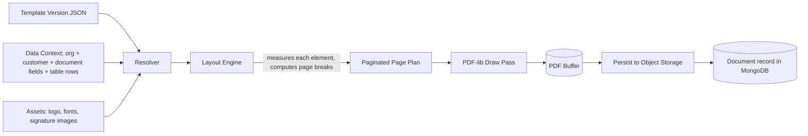

# 02 — System Architecture

## 2.1 High-Level Architecture



**Why a queue between API and rendering:** PDF generation for large statements (10k+ transaction rows, multi-page pagination, font embedding) is CPU/IO bound and must not block the request thread or starve the Node event loop. The API enqueues a render job and returns `202 Accepted` with a job id; the client polls or receives a websocket/SSE event, or for small documents a synchronous fast-path is used (see [06 — Flows §6.2](06-flows.md)).

## 2.2 Component Responsibilities

| Layer | Responsibility | Key Constraint |
|---|---|---|
| Controllers | HTTP parsing, request validation (Zod schemas shared with frontend via `shared/`), response shaping | No business logic |
| Services | Business rules: template versioning rules, permission checks beyond route-level RBAC, data context assembly | Framework-agnostic, unit-testable |
| Repositories | Mongoose query encapsulation, tenant-scoping (`organizationId` filter injected on every query) | No service ever queries Mongoose models directly |
| Rendering Engine | Pure function `(templateVersionJSON, dataContext, assets) -> Buffer(PDF)` | Must not access DB/network directly — all data passed in, fully testable offline |
| Workers | Consume queue jobs, call Services/Engine, persist results, emit notifications | Idempotent — re-running a job with the same job id must not duplicate output |

## 2.3 Tech Stack

| Concern | Choice | Notes |
|---|---|---|
| Frontend framework | React 19 + TypeScript + Vite | Strict mode, SWC/ESBuild via Vite |
| Styling | TailwindCSS + Shadcn UI | Design tokens shared with PDF theme tokens where sensible |
| Forms | React Hook Form + Zod | Schemas defined once in `shared/`, reused server-side for body validation |
| Data fetching | TanStack Query + Axios | Query keys namespaced per resource; mutations invalidate scoped keys |
| Routing | React Router v6 (data routers) | Route-level RBAC guards |
| Animation | Framer Motion | Page transitions, designer drag/drop, skeleton-to-content transitions |
| Backend framework | Node.js + Express.js | |
| ORM | Mongoose | Schemas in `server/src/models` |
| DB | MongoDB (replica set in prod) | Change streams used for live-preview invalidation (optional) |
| Auth | JWT (access + refresh), bcrypt | Access token short-lived (15 min), refresh token rotated + stored hashed |
| File handling | Multer (upload) + Sharp (image processing) | Sharp generates thumbnails, normalizes to PNG for embedding |
| PDF | pdf-lib + `@pdf-lib/fontkit` | Embedded TTF/OTF, vector shapes, image embedding |
| QR/Barcode | `qrcode` + `bwip-js`/`jsbarcode` (server-side canvas) rendered to PNG, embedded via pdf-lib | pdf-lib has no native barcode/QR primitive |
| Queue/Cache | Redis (BullMQ for jobs) | Also backs rate limiting (sliding window) |
| Object storage | S3-compatible (MinIO locally, S3/Azure Blob/GCS in prod) | Local disk only for dev fallback |
| Docs | Swagger (OpenAPI 3, `swagger-jsdoc`) | Served at `/api/docs` |
| Logging | Winston (JSON in prod, pretty in dev) + request-id correlation | Shipped to stdout → collected by platform log aggregator |
| Containerization | Docker, Docker Compose | Separate images: `client`, `server`, `worker` (same codebase, different entrypoint) |
| CI/CD | GitHub Actions | Lint → typecheck → test → build → docker push → deploy |
| Quality | ESLint, Prettier, Husky + lint-staged, commitlint | Pre-commit: lint+format; pre-push: typecheck+test |

## 2.4 Repository / Folder Structure

```
/
├── client/                      # React SPA
│   ├── src/
│   │   ├── app/                 # App shell, providers, router config
│   │   ├── pages/                # Route-level pages (Dashboard, Templates, Documents, ...)
│   │   ├── features/             # Feature-sliced modules (templates/, documents/, customers/, ...)
│   │   │   └── templates/
│   │   │       ├── designer/     # Canvas, element palette, property panel
│   │   │       ├── components/
│   │   │       ├── hooks/
│   │   │       ├── api.ts        # Axios calls, TanStack Query hooks
│   │   │       └── types.ts
│   │   ├── components/ui/        # Shadcn-generated primitives
│   │   ├── components/common/    # App-specific reusable components (DataTable, EmptyState, ...)
│   │   ├── lib/                  # axios instance, query client, auth storage
│   │   ├── hooks/                 # cross-feature hooks (useAuth, usePermission, useDebounce)
│   │   ├── stores/                 # lightweight client state (zustand) for UI-only state (designer canvas selection, theme)
│   │   ├── styles/
│   │   └── main.tsx
│   └── vite.config.ts
│
├── server/                       # Express API + workers
│   ├── src/
│   │   ├── config/                # env loading, db connection, redis, logger, swagger
│   │   ├── modules/                # one folder per domain module
│   │   │   ├── auth/
│   │   │   ├── users/
│   │   │   ├── roles/
│   │   │   ├── organizations/
│   │   │   ├── customers/
│   │   │   ├── templates/
│   │   │   │   ├── templates.routes.ts
│   │   │   │   ├── templates.controller.ts
│   │   │   │   ├── templates.service.ts
│   │   │   │   ├── templates.repository.ts
│   │   │   │   ├── templates.validation.ts   (zod)
│   │   │   │   └── template-versions/
│   │   │   ├── documents/
│   │   │   ├── assets/
│   │   │   ├── imports/
│   │   │   ├── audit-logs/
│   │   │   └── settings/
│   │   ├── engine/                # Rendering Engine (pure, framework-agnostic)
│   │   │   ├── elements/          # one renderer per element type
│   │   │   ├── layout/            # pagination, flow, measurement
│   │   │   ├── resolvers/         # field/template binding resolution ({{}} interpolation)
│   │   │   ├── fonts/
│   │   │   └── index.ts           # render(templateVersion, dataContext, assets): Buffer
│   │   ├── workers/                # BullMQ processors
│   │   ├── middleware/             # auth, rbac, error handler, rate-limit, validate, audit
│   │   ├── utils/
│   │   └── app.ts / server.ts
│   └── tests/
│       ├── unit/
│       ├── integration/
│       └── e2e/
│
├── shared/                       # Code shared by client + server
│   ├── schemas/                  # Zod schemas (template JSON, field defs, DTOs)
│   ├── types/                    # Shared TS types generated from schemas
│   └── constants/                 # Roles, permissions, document types, paper sizes
│
├── docs/                          # This PRD + architecture decision records + API docs
├── docker/
│   ├── client.Dockerfile
│   ├── server.Dockerfile
│   ├── worker.Dockerfile
│   └── docker-compose.yml
└── .github/workflows/
```

**Rule enforced by `shared/`:** the Template JSON schema, field-type enums, and validation rules are defined **once** as Zod schemas in `shared/schemas`. The client imports them for form validation; the server imports the same schemas for request-body validation. This guarantees the designer can never produce a template the renderer rejects.

## 2.5 Template → Data → Render Pipeline (Detail)



1. **Resolver** walks the template JSON, substitutes every `{{path.to.field}}` token against the data context, applies field formatters (currency/date/number), and evaluates conditional-visibility expressions.
2. **Layout Engine** is the only component aware of page geometry. It measures resolved element heights (text wrapping, table row counts) and decides page breaks, repeating header/footer on every page, and re-flowing table rows across pages with header repeat.
3. **PDF-lib Draw Pass** takes the final page plan (already paginated, already positioned) and is a "dumb" drawing step — it never makes layout decisions, only draws what it's told.

This separation (`Resolver` → `Layout` → `Draw`) is what makes the engine reusable: every document type goes through the identical three steps; only the JSON differs.
