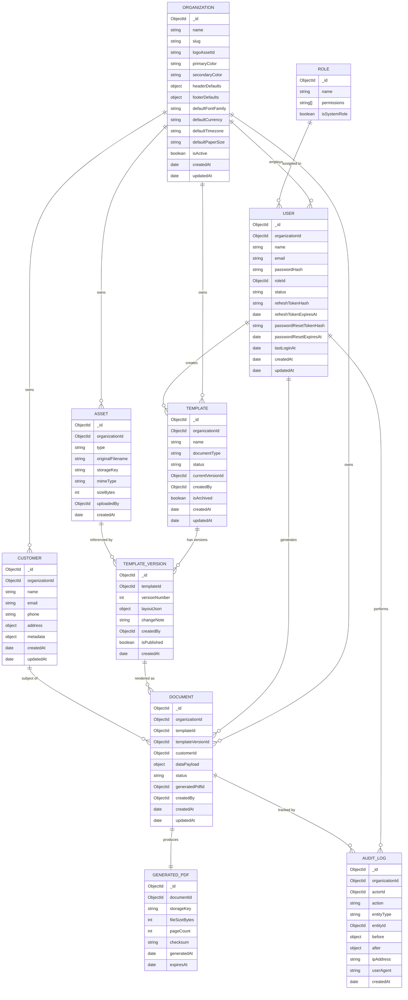

# 03 — Database Design

## 3.1 ER Diagram

## 3.2 Collection Schemas

### 3.2.1 `users`

| Field | Type | Notes |
|---|---|---|
| `organizationId` | ObjectId, ref `organizations`, indexed | Tenant scope; `null` only for the bootstrap super-admin |
| `name` | String, required | |
| `email` | String, required, unique (compound unique with `organizationId` if multi-tenant emails are allowed to repeat across orgs — **decision: globally unique** to keep login lookup O(1) without org context) | |
| `passwordHash` | String, required, `select: false` | bcrypt, cost 12 |
| `roleId` | ObjectId, ref `roles`, required | |
| `status` | Enum `active, invited, suspended, deleted` | Soft-disable instead of hard delete |
| `refreshTokenHash` | String, `select: false` | SHA-256 hash of current refresh token; rotated every use |
| `refreshTokenExpiresAt` | Date | |
| `passwordResetTokenHash` | String, `select: false` | |
| `passwordResetExpiresAt` | Date | |
| `failedLoginAttempts` | Number, default 0 | For lockout policy |
| `lockedUntil` | Date | |
| `lastLoginAt` | Date | |
| `mfaEnabled` | Boolean, default false | Reserved field for future TOTP |
| Indexes | `{ email: 1 }` unique; `{ organizationId: 1, status: 1 }` | |

### 3.2.2 `roles`

| Field | Type | Notes |
|---|---|---|
| `name` | Enum `admin, manager, editor, viewer` (extensible to custom roles later via `isSystemRole: false`) | |
| `permissions` | String[] | Permission strings, e.g. `templates:write`, `documents:generate`, see [07](07-rbac-permissions.md) |
| `isSystemRole` | Boolean | System roles cannot be deleted/renamed |

### 3.2.3 `organizations`

| Field | Type | Notes |
|---|---|---|
| `name`, `slug` | String | `slug` unique, used in subdomain/white-label routing later |
| `logoAssetId` | ObjectId ref `assets` | |
| `primaryColor`, `secondaryColor` | String (hex) | Injected as template theme defaults |
| `headerDefaults`, `footerDefaults` | Object | Default header/footer JSON merged into new templates |
| `defaultFontFamily` | String | Must reference an `assets` entry of type `font` or a bundled system font |
| `defaultCurrency`, `defaultTimezone`, `defaultPaperSize` | String | ISO 4217 / IANA TZ / enum `A4, LETTER, LEGAL` |
| `isActive` | Boolean | Disabling an org disables login for all its users |

### 3.2.4 `customers`

| Field | Type | Notes |
|---|---|---|
| `organizationId` | ObjectId, indexed | |
| `name`, `email`, `phone` | String | `email` optional (some statement subjects have no email) |
| `address` | Object `{ line1, line2, city, state, postalCode, country }` | |
| `metadata` | Object (free-form Map) | Arbitrary custom key/value, e.g. `accountNumber`, `branch` |
| Indexes | `{ organizationId: 1, name: "text" }`, `{ organizationId: 1, email: 1 }` | Text index powers global search |

### 3.2.5 `templates`

| Field | Type | Notes |
|---|---|---|
| `organizationId` | ObjectId, indexed | |
| `name` | String, required | |
| `documentType` | Enum (extensible string, not hard enum in DB — validated against a configurable list in `shared/constants`) | `invoice, salary_slip, account_statement, ...` |
| `status` | Enum `draft, published, archived` | Only `published` templates are selectable for document generation |
| `currentVersionId` | ObjectId ref `template_versions` | Always points at the latest **published** version used for generation |
| `createdBy` | ObjectId ref `users` | |
| `isArchived` | Boolean | Archived templates hidden from pickers but retained for historical documents |
| `tags` | String[] | For search/filter |
| Indexes | `{ organizationId: 1, status: 1, documentType: 1 }`, `{ organizationId: 1, name: "text" }` | |

### 3.2.6 `template_versions`

| Field | Type | Notes |
|---|---|---|
| `templateId` | ObjectId, indexed | |
| `versionNumber` | Number | Monotonically increasing per template, starts at 1 |
| `layoutJson` | Object | Full validated Template JSON (see [04](04-template-json-schema.md)) — **immutable once created** |
| `changeNote` | String | Optional free text on save ("Added GST table") |
| `createdBy` | ObjectId ref `users` | |
| `isPublished` | Boolean | A template can have many draft versions but the `templates.currentVersionId` only ever points to a published one |
| Indexes | `{ templateId: 1, versionNumber: -1 }` unique compound | Enables fast "latest version" and "compare any two versions" lookups |

Versions are **never mutated or deleted** (append-only) — this is what makes rollback/compare/audit trivial: rollback = create a new version whose `layoutJson` is a copy of an older version's, then publish it. "Restore" never rewrites history.

### 3.2.7 `documents`

| Field | Type | Notes |
|---|---|---|
| `organizationId`, `templateId`, `templateVersionId` | ObjectId, indexed | `templateVersionId` pinned at generation time so re-rendering a historical document always uses the version it was created with, even if the template has since changed |
| `customerId` | ObjectId ref `customers`, nullable | Null for non-customer documents (e.g. internal reports) |
| `dataPayload` | Object | The full resolved data context used for this generation (denormalized snapshot, not a live reference) — required for reproducible re-render and audit |
| `status` | Enum `draft, generating, generated, failed` | `generating` while the worker is rendering; supports polling |
| `generatedPdfId` | ObjectId ref `generated_pdfs`, nullable until status = generated | |
| `failureReason` | String, nullable | Populated when `status = failed` |
| `createdBy` | ObjectId ref `users` | |
| Indexes | `{ organizationId: 1, createdAt: -1 }`, `{ organizationId: 1, templateId: 1 }`, `{ organizationId: 1, customerId: 1 }`, `{ organizationId: 1, status: 1 }` | |

### 3.2.8 `generated_pdfs`

| Field | Type | Notes |
|---|---|---|
| `documentId` | ObjectId, unique, indexed | 1:1 with `documents` |
| `storageKey` | String | Object storage path, never a public URL — always served via signed URL through the API |
| `fileSizeBytes`, `pageCount`, `checksum` (SHA-256) | | Checksum allows integrity verification and dedup detection |
| `generatedAt` | Date | |
| `expiresAt` | Date, nullable | Optional retention policy per org settings |

### 3.2.9 `assets`

| Field | Type | Notes |
|---|---|---|
| `organizationId` | ObjectId, indexed | |
| `type` | Enum `logo, icon, image, font, signature` | |
| `originalFilename`, `mimeType`, `sizeBytes` | | |
| `storageKey` | String | |
| `checksum` | String | Prevents duplicate re-upload bloat (dedup by checksum within an org) |
| `uploadedBy` | ObjectId ref `users` | |
| `metadata` | Object | For fonts: `{ family, weight, style }`; for images: `{ width, height }` (via Sharp) |
| Indexes | `{ organizationId: 1, type: 1 }` | |

### 3.2.10 `audit_logs`

| Field | Type | Notes |
|---|---|---|
| `organizationId` | ObjectId, indexed | |
| `actorId` | ObjectId ref `users` | |
| `action` | Enum, see [07 §7.3](07-rbac-permissions.md) | `login, template.create, template.update, template.publish, document.generate, document.download, document.delete, permission.change, ...` |
| `entityType`, `entityId` | String, ObjectId | Polymorphic reference |
| `before`, `after` | Object, nullable | Diff snapshots for update actions |
| `ipAddress`, `userAgent` | String | |
| Indexes | `{ organizationId: 1, createdAt: -1 }`, `{ organizationId: 1, entityType: 1, entityId: 1 }`, `{ actorId: 1, createdAt: -1 }` | TTL index optional (e.g. 2 years) per compliance settings |

## 3.3 Multi-Tenancy Enforcement

Every collection except `roles` carries `organizationId`. The Repository layer (see [02 §2.2](02-architecture.md)) injects `organizationId` from the authenticated request context into **every** query automatically — controllers/services never pass it manually, eliminating the single most common multi-tenant bug class (a developer forgetting the tenant filter). A repository-layer test asserts that every exported query function requires an org-scoped context object, not a bare filter.

## 3.4 Why MongoDB Document Shape Fits This Domain

- `layoutJson` and `dataPayload` are naturally nested, variable-shape trees (elements, table rows, nested sections) — forcing them into relational tables would require either heavy JSON columns anyway or an explosion of join tables for zero benefit, since these blobs are never queried by sub-field, only loaded whole and interpreted by the rendering engine.
- Append-only `template_versions` and `audit_logs` match MongoDB's strength for high-write, rarely-updated, time-ordered data.
- Relational integrity that *does* matter (org scoping, role references, document → template version pinning) is enforced at the application layer via the Repository pattern, with Mongoose schema-level `ref` for population convenience — not by DB-level foreign keys, which Mongo doesn't enforce anyway.
