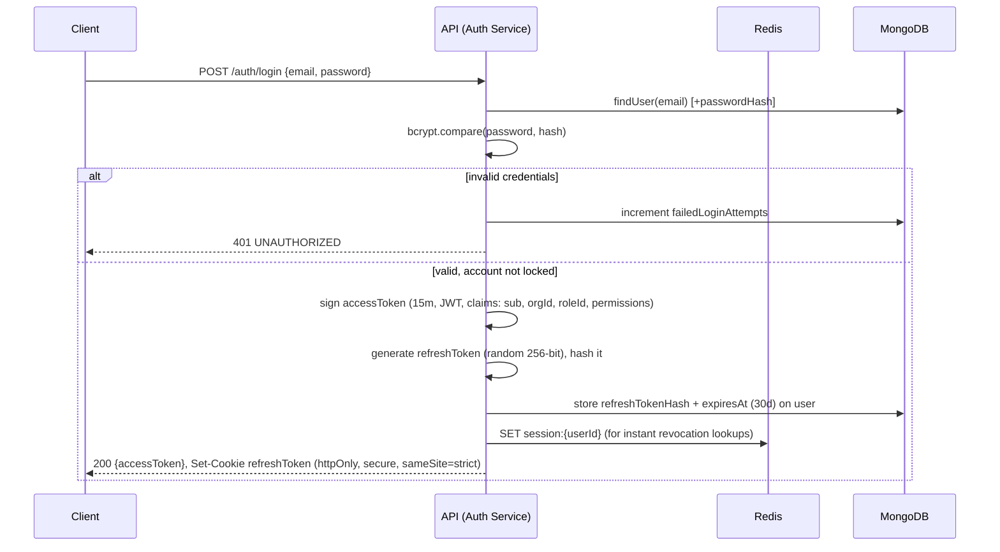
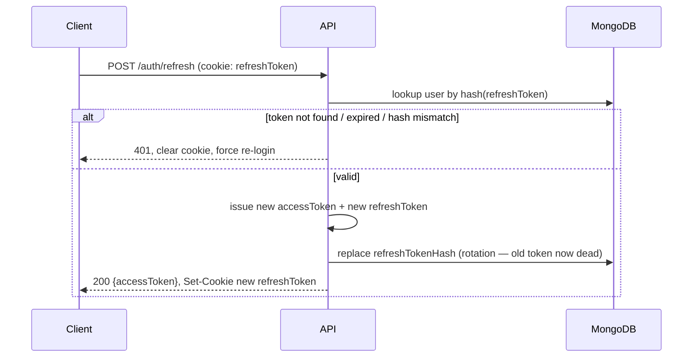
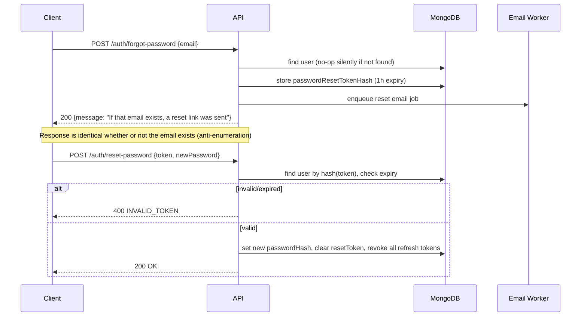
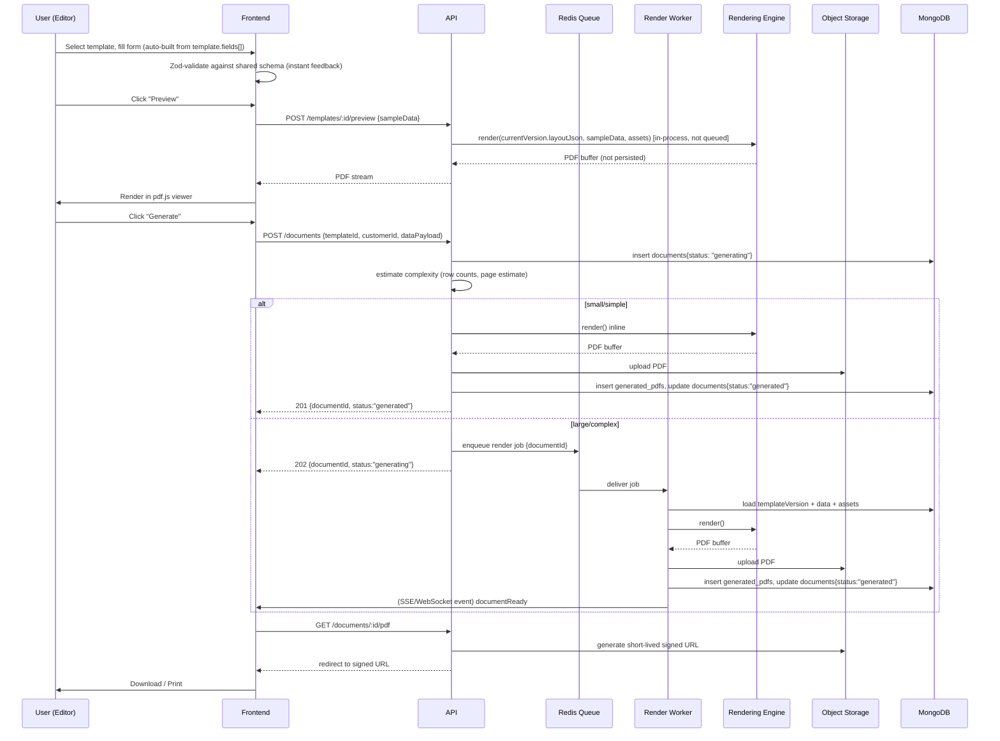
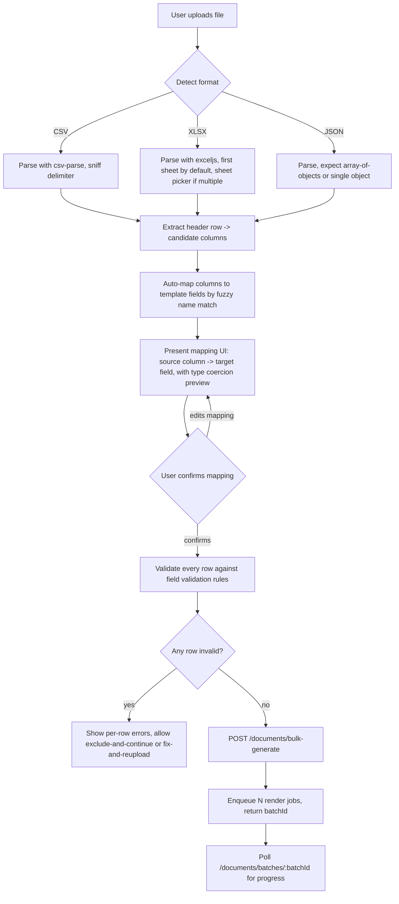
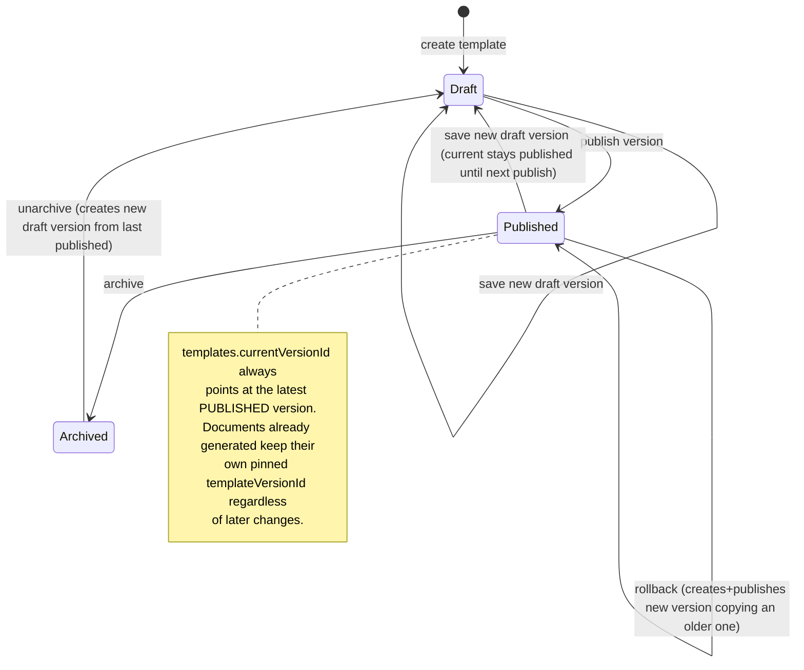
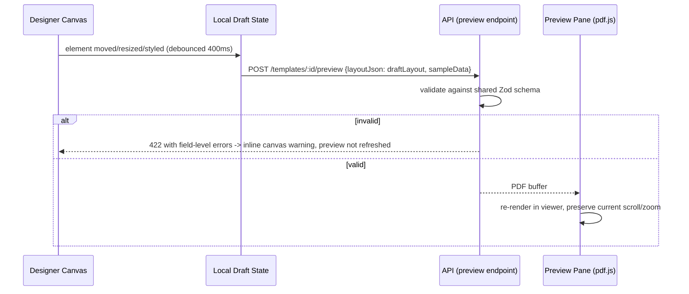

# 06 — Core Flows

## 6.1 Authentication Flow

### 6.1.1 Login + Token Lifecycle

### 6.1.2 Refresh & Rotation

Rotation means a stolen refresh token is single-use from the legitimate client's perspective: if an attacker replays an old token after the legitimate client has already rotated, the hash won't match and **both** sessions are invalidated, surfacing the theft immediately rather than silently.

### 6.1.3 Forgot / Reset Password

All existing refresh tokens are revoked on password reset, forcing re-login everywhere — standard session-invalidation hygiene after a credential change.

## 6.2 Document Generation Flow

Two paths exist depending on document size, decided server-side, transparently to the client API contract:

- **Sync fast-path**: estimated render time < ~800ms (small templates, few/no large tables) → render inline, return the document already `generated`.
- **Async path**: large tables / multi-page / bulk → enqueue, return `generating`, client polls or subscribes.

**Failure path:** if `ENG.render()` throws (e.g. unresolvable required field, corrupt asset), the worker sets `documents.status = "failed"` with `failureReason`, and the job is **not** retried automatically more than 2x (render failures are almost always deterministic data/template problems, not transient infra blips — endless retry just burns the queue). The UI surfaces the failure reason and lets the user fix data and resubmit as a *new* generation rather than mutating the failed record.

## 6.3 Data Import Flow (CSV / Excel / JSON)

**Mapping rules:**
- Auto-mapping matches by normalized header text (case/space/underscore-insensitive) against `field.label` and `field.key`, plus a small synonym table (`"acct no" → accountNumber`, `"amt" → amount`).
- Numbers/dates are coerced using the field's declared `format`; coercion failures are per-row errors, not whole-import aborts.
- Rows exceeding a configurable max (default 50,000 rows/import) are rejected up front with a clear error rather than silently truncated — see [10](10-edge-cases.md) for the full import edge-case table.

## 6.4 Template Versioning & Lifecycle

- **Duplicate**: copies a Template + its current version into a brand-new Template (new id, status `draft`) — used as a starting point for a similar document type.
- **Compare**: structural diff between any two versions of the *same* template (element added/removed/moved/restyled), rendered as a side-by-side or unified list in the UI; computed by a deep diff of `layoutJson` keyed by element `id`.
- **Rollback**: never edits history — creates version N+1 with `layoutJson` copied from the selected old version, then publishes it. This means the audit trail always shows a forward-only sequence of versions, and "what was published when" is always answerable.

## 6.5 Live Preview Flow

Debouncing + sending the *draft* (unsaved) layout directly to the same `render()` used for real documents guarantees the preview is never a simulated approximation — it is pixel-identical to what generation will produce, because it's the same code path.
