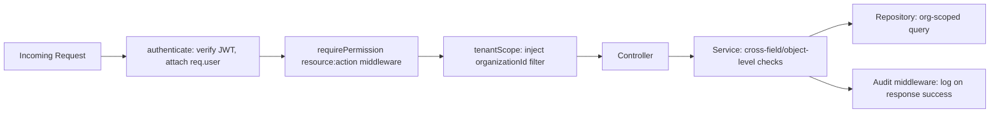

# 07 — RBAC & Permissions

## 7.1 Permission Model

Permissions are flat strings `resource:action`, attached to roles (not users directly). Route middleware checks `req.user.permissions.includes(required)`; service-layer checks re-verify for actions that aren't 1:1 with a route (e.g. "can this user publish *this specific* template" also requires org match, not just the permission string).

| Resource | Actions |
|---|---|
| `templates` | `read, write, publish, delete, version` |
| `documents` | `read, generate, delete, download` |
| `customers` | `read, write, delete` |
| `organizations` | `read, write` |
| `users` | `read, write, delete` |
| `roles` | `read, write` |
| `assets` | `read, write, delete` |
| `settings` | `read, write` |
| `logs` | `read` |

## 7.2 Role × Permission Matrix

| Permission | Admin | Manager | Editor | Viewer |
|---|---|---|---|---|
| `templates:read` | ✅ | ✅ | ✅ | ✅ |
| `templates:write` | ✅ | ✅ | ❌ | ❌ |
| `templates:publish` | ✅ | ✅ | ❌ | ❌ |
| `templates:version` | ✅ | ✅ | ❌ | ❌ |
| `templates:delete` | ✅ | ❌ | ❌ | ❌ |
| `documents:read` | ✅ | ✅ | ✅ | ✅ |
| `documents:generate` | ✅ | ✅ | ✅ | ❌ |
| `documents:download` | ✅ | ✅ | ✅ | ✅ |
| `documents:delete` | ✅ | ✅ | ❌ | ❌ |
| `customers:read` | ✅ | ✅ | ✅ | ✅ |
| `customers:write` | ✅ | ✅ | ❌ | ❌ |
| `customers:delete` | ✅ | ❌ | ❌ | ❌ |
| `organizations:read` | ✅ | ✅ | ✅ | ✅ |
| `organizations:write` | ✅ | ❌ | ❌ | ❌ |
| `users:read` | ✅ | ✅ | ❌ | ❌ |
| `users:write` | ✅ | ✅ (cannot grant Admin role) | ❌ | ❌ |
| `users:delete` | ✅ | ❌ | ❌ | ❌ |
| `roles:read` | ✅ | ✅ | ❌ | ❌ |
| `roles:write` | ✅ | ❌ | ❌ | ❌ |
| `assets:read` | ✅ | ✅ | ✅ | ✅ |
| `assets:write` | ✅ | ✅ | ❌ | ❌ |
| `assets:delete` | ✅ | ❌ | ❌ | ❌ |
| `settings:read` | ✅ | ✅ | ✅ | ✅ |
| `settings:write` | ✅ | ❌ | ❌ | ❌ |
| `logs:read` | ✅ | ✅ | ❌ | ❌ |

This matrix matches the brief's intent literally: *Admin = everything, Manager = templates + documents + users, Editor = documents, Viewer = read-only* — expanded to every resource so there's no ambiguous gap.

## 7.3 Enforcement Points

Object-level checks the route-level permission string cannot express, enforced in the Service layer:

- A Manager cannot elevate a user to `Admin` (even though `users:write` is granted) — checked explicitly in `users.service.ts`.
- A user can only act within their own `organizationId`; cross-org access attempts return `404` (not `403`, to avoid confirming the resource exists in another tenant).
- `templates:delete` (Admin-only) is blocked with `409 CONFLICT` if the template has any non-deleted `documents` referencing it — archive instead of hard delete is offered as the resolution.

## 7.4 Audit Log Action Catalog

| Action | Trigger | Captures |
|---|---|---|
| `auth.login.success` / `auth.login.failure` | Every login attempt | email, ip, userAgent |
| `auth.password.reset` | Password reset completed | userId |
| `template.create` / `template.update` / `template.archive` | Template metadata or version save | before/after diff |
| `template.publish` | Version published | versionNumber |
| `template.rollback` | Restore-as-new-version | fromVersion → toVersion |
| `document.generate` | Document created (sync or enqueued) | templateId, customerId |
| `document.download` | PDF signed-URL issued | documentId |
| `document.delete` | Soft delete | documentId |
| `user.role.change` | Role reassigned | before role → after role |
| `permission.change` | Custom role permission set modified | before/after permission array |
| `asset.upload` / `asset.delete` | Asset lifecycle | assetId, type |
| `customer.delete` | Customer removed | customerId |

Every entry is **immutable** (no update/delete API exists for `audit_logs` — only `GET`), and write failures to the audit collection are treated as a logged warning, never as a reason to fail the underlying business action (audit is observability, not a transactional gate).
