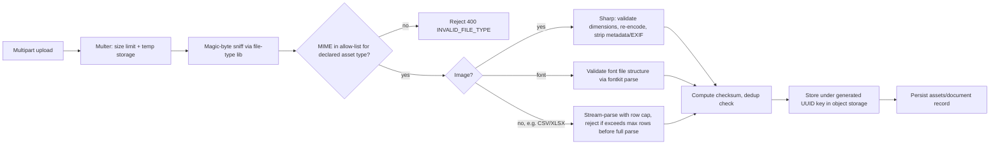

# 08 — Security Architecture

## 8.1 Threats × Mitigations

| Threat | Mitigation |
|---|---|
| Credential stuffing / brute force login | Rate limit 5/15min per IP+email, exponential account lockout after repeated failures, bcrypt cost 12 |
| JWT theft via XSS | Access token kept in memory only (never localStorage); refresh token in `httpOnly, secure, sameSite=strict` cookie, inaccessible to JS |
| CSRF on state-changing routes | `sameSite=strict` cookie + double-submit CSRF token header required on cookie-authenticated routes (refresh/logout); Bearer-token routes are inherently CSRF-immune since browsers don't auto-attach `Authorization` headers |
| XSS via template text/rich text | Rich-text subset is a closed markup grammar (bold/italic/linebreak only), not raw HTML; rendered server-side into PDF drawing instructions, never injected into the client DOM as `innerHTML` |
| Stored XSS via customer/template data | All free text rendered in the React UI via JSX text nodes (auto-escaped); no `dangerouslySetInnerHTML` anywhere in the codebase — enforced by an ESLint rule |
| SQL/NoSQL injection | Mongoose schema-typed queries only; no raw `$where`/string-concatenated queries; all request bodies validated by Zod before touching the DB layer |
| Path traversal via filenames | Uploaded files are renamed to a generated UUID + extension derived from validated MIME type; original filename stored as metadata only, never used to build a filesystem/storage path |
| Malicious file upload (polyglot, embedded script in SVG, oversized image bomb) | Multer file-size cap, MIME allow-list, magic-byte sniffing (not trusting the `Content-Type` header), SVGs sanitized (strip `<script>`/event handlers) before storage, Sharp re-encodes raster images (strips embedded payloads), max pixel-dimension cap to block decompression-bomb images |
| Arbitrary code execution via template `visibleIf` expressions | Custom restricted expression evaluator (comparisons/booleans/literals/token refs only) — no `eval`, no `new Function`, no access to Node globals — see [04 §4.7](04-template-json-schema.md) |
| SSRF via image/logo URL fields | Image `src` accepts only internal asset references (`assetId`), never arbitrary external URLs, by schema design — there is no "fetch this URL and embed it" code path |
| Tenant data leakage (cross-org access) | Repository layer mandates an org-scoped context object on every query (see [03 §3.3](03-database-design.md)); cross-org object access returns `404` |
| Privilege escalation (self-granting Admin) | Service-layer check blocks Manager from assigning `Admin` role; role changes are themselves permission-gated and audit-logged |
| Sensitive data in logs | Winston redaction transform strips `password`, `token`, `authorization`, `passwordHash` keys from any logged object before serialization |
| PDF link-based phishing / data exfiltration via signed URLs | Signed URLs are short-lived (5 min default), single-resource-scoped, and not guessable (HMAC-signed, not sequential ids) |
| Denial of service via huge render jobs | Hard caps: max table rows per document (configurable, default 50k), max import rows per file (50k), max concurrent bulk-generate batches per org (5), worker-level render timeout (30s) that fails the job rather than hanging a worker process |
| Dependency supply-chain risk | `npm audit`/`pnpm audit` in CI gate, Dependabot/Renovate for patch updates, lockfile committed, no postinstall scripts from unverified packages |
| Clickjacking | `helmet` sets `X-Frame-Options: DENY` / CSP `frame-ancestors 'none'` |
| MITM | HSTS enforced, TLS-only in production, cookies marked `secure` |

## 8.2 Security Middleware Stack (Express, applied in order)

1. `helmet()` — sensible secure headers (CSP, HSTS, X-Content-Type-Options, etc.)
2. `cors()` — explicit allow-list of origins (the SPA's own origin in prod; configurable per env)
3. `compression()`
4. Body size limit (`express.json({ limit: '2mb' })`) — generous enough for `dataPayload` with embedded table rows, capped to prevent payload-bomb POSTs
5. Request-id assignment + Winston request logger
6. Rate limiter (Redis-backed, per route-class — see [05 §5.14](05-api-design.md))
7. `authenticate` — JWT verify, attaches `req.user`
8. `requirePermission(...)` — RBAC gate
9. Route-specific Zod `validate(schema)` middleware
10. Controller → Service → Repository
11. Centralized error handler — maps thrown errors to the standard error envelope, never leaks stack traces in production responses (logged server-side only)

## 8.3 File Upload Validation Pipeline

## 8.4 Data Protection

| Data | At Rest | In Transit |
|---|---|---|
| Passwords | bcrypt hash only, never reversible, never logged | TLS |
| Refresh tokens | SHA-256 hash stored, raw token never persisted | TLS, httpOnly cookie |
| Generated PDFs | Object storage with server-side encryption (provider-managed keys in v1; customer-managed keys roadmap item) | Signed URL over TLS |
| `dataPayload` (may contain PII: customer name, address, account numbers) | Encrypted at the storage-engine level (MongoDB encryption at rest enabled in prod) | TLS |
| Audit logs | Immutable, retained per compliance setting | TLS |
