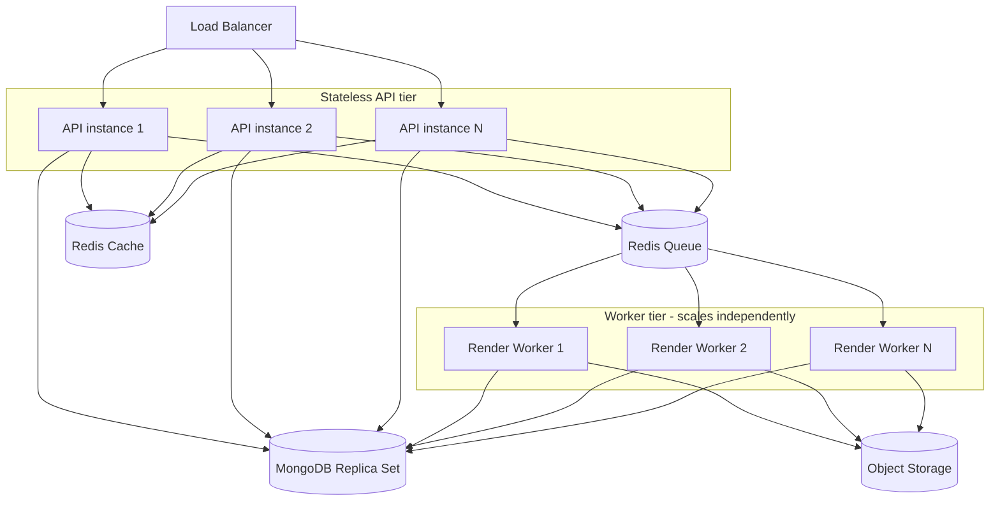
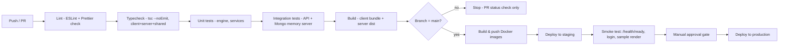

# 09 — Non-Functional Requirements, Deployment & CI/CD

## 9.1 Performance Targets

| Metric | Target |
|---|---|
| API p95 latency (non-render endpoints) | < 200ms |
| Sync-path PDF generation (single page, < 50 rows) | < 800ms end-to-end |
| Async-path PDF generation (multi-page, thousands of rows) | < 8s for a 20-page / 5,000-row statement |
| Dashboard initial load (cached) | < 1.5s LCP |
| Live preview re-render after edit | < 1s from debounce trigger to rendered preview |
| Bulk-generate throughput | ≥ 50 documents/minute/worker node |

## 9.2 Scalability Plan



- **API tier**: fully stateless (JWT, no server-side session) → scales horizontally behind the load balancer with no sticky sessions required.
- **Worker tier**: scales independently of the API tier because render load (CPU-bound) and request load (I/O-bound) have different scaling curves; BullMQ concurrency per worker tuned to CPU core count.
- **MongoDB**: replica set for read scaling + HA; sharding by `organizationId` is the designed path once a single replica set's write throughput becomes the bottleneck (schema already keys every collection by `organizationId`, making range/hash sharding on that key a non-breaking future migration).
- **Object storage**: inherently horizontally scalable (S3-compatible), not a bottleneck.
- **Redis**: used for cache + queue + rate-limit; sized to fit hot data (sessions, rate-limit counters, job queue) — not a system-of-record, so it can be flushed/resized without data loss risk to the platform.

## 9.3 Caching Strategy

| Cached Data | Store | TTL / Invalidation |
|---|---|---|
| Published template `layoutJson` | Redis | Invalidated on publish; read-through cache for render hot path |
| Organization branding (logo, colors) | Redis | Invalidated on org update |
| Rendered fonts (parsed/embedded font byte buffers) | In-process LRU per worker | Process lifetime; fonts are immutable assets once uploaded |
| Dashboard KPI aggregates | Redis | 60s TTL, background-refreshed |
| `/auth/me` permission set | Embedded in JWT claims | Re-issued on next token refresh after a role change (max 15min staleness window, acceptable given access-token lifetime) |

## 9.4 Docker & Compose

```yaml
# docker/docker-compose.yml (excerpt)
services:
  client:
    build: { context: .., dockerfile: docker/client.Dockerfile }
    ports: ["5173:80"]
  server:
    build: { context: .., dockerfile: docker/server.Dockerfile }
    env_file: ../server/.env
    ports: ["4000:4000"]
    depends_on: [mongo, redis]
  worker:
    build: { context: .., dockerfile: docker/worker.Dockerfile }
    env_file: ../server/.env
    depends_on: [mongo, redis]
    deploy: { replicas: 2 }
  mongo:
    image: mongo:7
    volumes: ["mongo-data:/data/db"]
  redis:
    image: redis:7-alpine
  minio:
    image: minio/minio
    command: server /data
    volumes: ["minio-data:/data"]
volumes:
  mongo-data:
  minio-data:
```

`server` and `worker` build from the same codebase with different `CMD` entrypoints (`node dist/server.js` vs `node dist/worker.js`) — one image, two run modes, to avoid drift between API and worker dependency versions.

## 9.5 CI/CD Pipeline (GitHub Actions)



- Husky pre-commit: `lint-staged` (ESLint + Prettier on staged files only).
- Husky pre-push: `tsc --noEmit` + unit tests, to keep pushes fast but catch type errors before they hit CI.
- PR checks block merge on any failed stage; `main` is protected, requires green CI + 1 review.

## 9.6 Observability

| Concern | Tool |
|---|---|
| Structured logs | Winston (JSON), request-id correlation across API → worker via job payload |
| Metrics | `/metrics` (Prometheus format): request rate/latency histograms, queue depth, render duration histogram, render failure rate |
| Health checks | `/health` (liveness), `/health/ready` (DB+Redis+storage reachability) — wired to container orchestrator probes |
| Error tracking | Centralized error handler tags errors with request id; integrates with an external error tracker (Sentry-compatible) via a pluggable transport |
| Alerting thresholds | Queue depth > N for > 5min, render failure rate > 5%, p95 latency breach, disk/object-storage quota approaching limit |

## 9.7 Testing Strategy

| Layer | Approach |
|---|---|
| Rendering Engine | Pure-function unit tests: given fixed `(layoutJson, dataContext)` pairs, assert exact page count, element positions, and (via PDF text extraction) rendered text content — engine is deterministic and DB-free, ideal for snapshot-style tests |
| Services | Unit tests with mocked repositories |
| Repositories | Integration tests against `mongodb-memory-server` |
| API routes | Integration tests (supertest) covering auth, RBAC denial paths, validation errors, happy paths |
| Frontend components | Component tests (React Testing Library) for forms, designer canvas interactions, table engine config UI |
| E2E | Playwright: login → create template → design → preview → generate → download, run against the Docker Compose stack in CI nightly |
| Load testing | k6 script targeting `/documents` bulk-generate to validate the worker-scaling assumptions in [9.2](#92-scalability-plan) before major releases |
